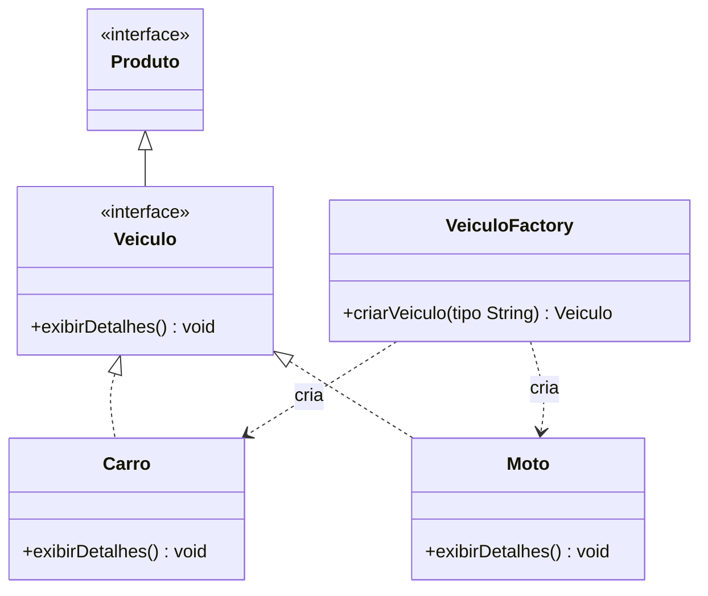
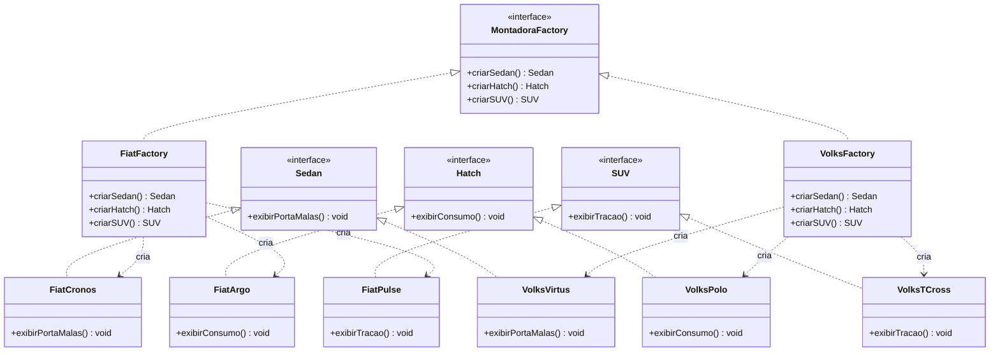

# Factory Method e Abstract Factory - Exemplo em Java Swing

Projeto de exemplo demonstrando os padrões de projeto Factory Method e Abstract Factory em Java Swing.

## Visao geral
Este repositorio contem:

- Parte 1 (Factory Method): criacao de `Veiculo` por meio de `VeiculoFactory`, com produtos concretos `Carro` e `Moto`.
- Partes 2 e 3 (Abstract Factory): familias Fiat e Volkswagen para `Sedan`, `Hatch` e `SUV`, usando `MontadoraFactory` e fabricas concretas.

Os diagramas abaixo descrevem as estruturas implementadas no codigo.

## Diagrama de Classes - Parte 1 (Factory Method)

## Diagrama de Classes - Partes 2 e 3 (Abstract Factory)

