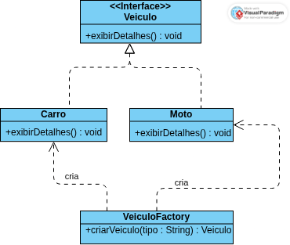
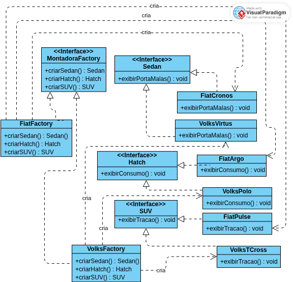

# Factory Method e Abstract Factory - Exemplo em Java Swing

Aluno: Gabriel Messias da Silva
Projeto de exemplo demonstrando os padrões de projeto Factory Method e Abstract Factory em Java Swing.

## O que este projeto faz
Este projeto implementa dois padrões de criação para mostrar, na prática, como desacoplar criação de objetos do código cliente.

- Na Parte 1 (Factory Method), a classe cliente solicita um `Veiculo` para a fábrica `VeiculoFactory`, que decide se retorna `Carro` ou `Moto`.
- Nas Partes 2 e 3 (Abstract Factory), o cliente escolhe uma família de produtos (`FiatFactory` ou `VolksFactory`) e cria objetos relacionados (`Sedan`, `Hatch` e `SUV`) mantendo compatibilidade entre eles.

Ao executar a aplicação, janelas `JOptionPane` exibem os resultados de cada criação para facilitar a visualização do comportamento dos padrões.

## Visao geral
Este repositorio contem:

- Parte 1 (Factory Method): criacao de `Veiculo` por meio de `VeiculoFactory`, com produtos concretos `Carro` e `Moto`.
- Partes 2 e 3 (Abstract Factory): familias Fiat e Volkswagen para `Sedan`, `Hatch` e `SUV`, usando `MontadoraFactory` e fabricas concretas.

## Estrutura principal
- `src/main/java/factorymethod`: implementacao da Parte 1.
- `src/main/java/abstractfactory`: implementacao das Partes 2 e 3.
- `src/main/java/io/github/fatec/Main.java`: ponto de entrada com os testes em Swing.
- `src/assets`: imagens dos diagramas exibidos neste README.

Os diagramas abaixo descrevem as estruturas implementadas no codigo.

## Diagrama de Classes - Parte 1 (Factory Method)

## Diagrama de Classes - Partes 2 e 3 (Abstract Factory)

